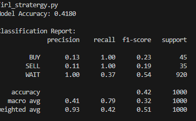
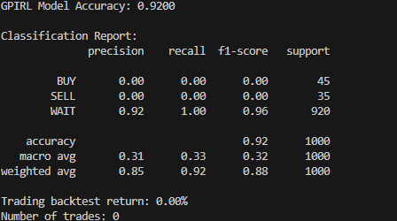

# Capturing Strategy of Trader

## Performance Summary

- **Gaussian Inverse Reinforcement Learning (GIRL)** is outperforming standard IRL.
- **Accuracy achieved:** 92.0% 🎯
- **Dataset:** Two images were used for validation.

## Visualizations

### Standard IRL
Run Standard IRL:
```bash
python irl.py




### Gussian inverse IRL
Run Standard IRL:
```bash
python irl.py




